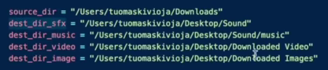

# File management automation

### Automate your Desktop File Management and de-clutter your Downloads Folder. This app will automatically organise & mve your downloads into folders based on file type.

- Working With Files in Python (article) - https://realpython.com/working-with-files-in-python/
- Watchdog (Python Library) - https://pythonhosted.org/watchdog/

